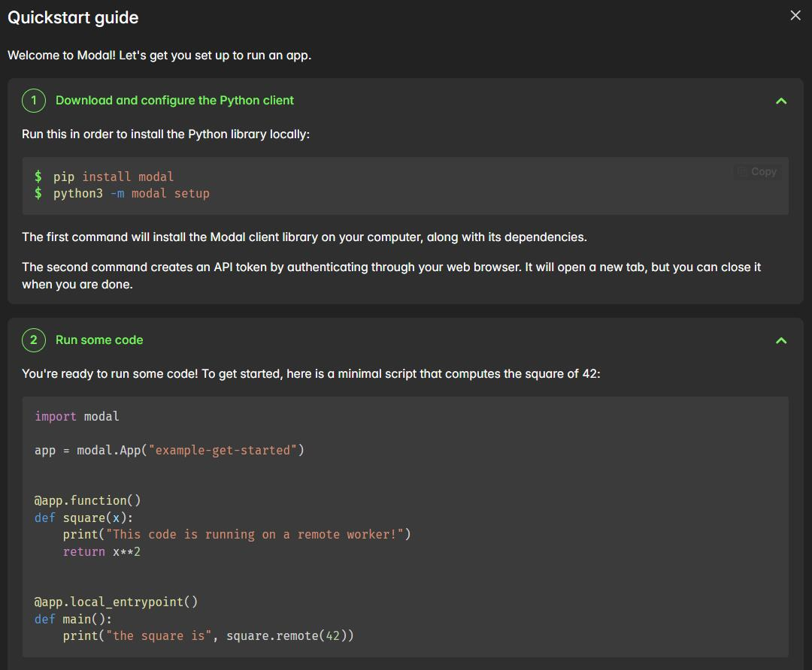

#  ☁️Modal Notes

---

### 001 -- Modal介绍
>Modal 是一个无服务器云计算平台，允许用 Python 定义远程函数并调用云端 GPU/CPU 资源，无需管理服务器与环境。通过 Image 声明依赖，实现代码级调度，适合 AI 与高性能计算任务。

### 002 -- 官方的 Hello World 

Modal 的两个装饰器

- @app.function - 定义云端执行函数 & 分配计算资源
- @app.local_entrypoint - 定义本地入口函数

>通过 modal run xxx.py 来提交任务
### 003 -- 

### 004 -- 

- .remote() = 向 Modal 服务器发送一个“执行请求”
