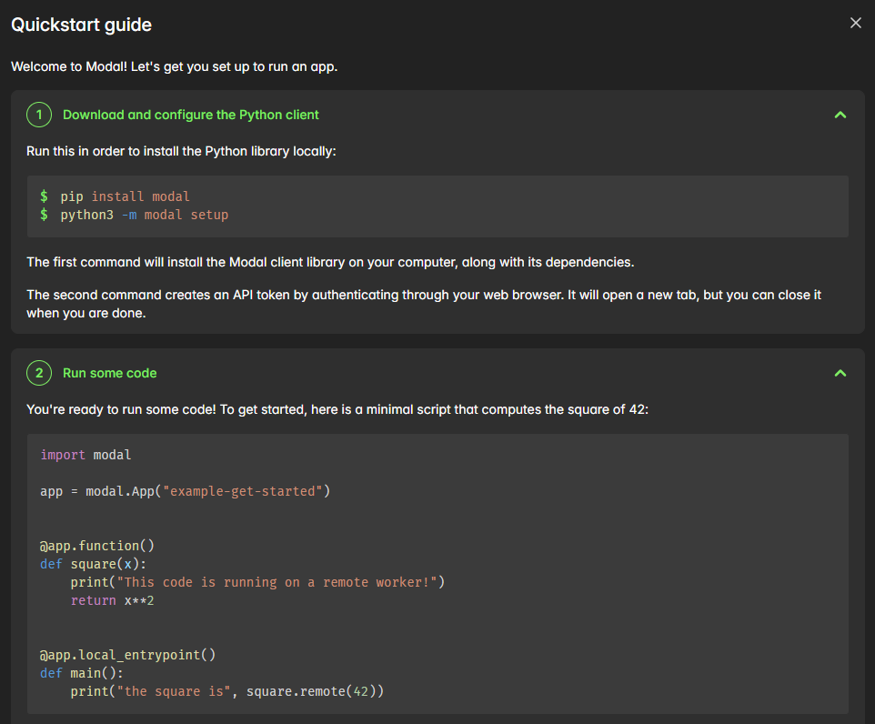

<h2 align="center">☁️ Modal 云计算平台学习笔记</h2>

<p align="center">
  <i> —— 2026.04.01</i>
</p>

<p align="center">
  
  
  
  
</p>


<p align="center">
  <a href="#basics-notes"></a>
  &nbsp;&nbsp;
  <a href="#concept-notes"></a>
  &nbsp;&nbsp;
  <a href="#cli-notes"></a>
</p>


---
<a id="basics-notes"></a>
# 🥕 Basics Notes

### 01 -- Modal 介绍
```text
Modal 是一个无服务器云计算平台，允许用 Python 定义远程函数并调用云端 GPU/CPU 资源，无需管理服务器与环境。通过 Image 声明依赖，实现代码级调度，适合 AI 与高性能计算任务。
```

### 02 -- 官方的 Hello World 


```text
通过在终端运行 modal run xxx.py 来提交任务
```

### 03 -- Modal 提供的 GPU 类型
| GPU 型号                            | 显存 (VRAM)              | 价格      |
| :---------------------------------- | :----------------------- | :-------- |
| T4                                  | 16 GB                    | $0.59 / h |
| L4                                  | 24 GB                    | $0.80 / h |
| A10                                 | 24 GB                    | $1.10 / h |
| L40S                                | 48 GB                    | $1.95 / h |
| A100-40GB                           | 40 GB                    | $2.10 / h |
| A100-80GB                           | 80 GB                    | $2.50 / h |
| RTX PRO 6000（一般指 RTX 6000 Ada） | 48 GB                    | $3.03 / h |
| H100                                | 80 GB                    | $3.95 / h |
| H200                                | 141 GB                   | $4.54 / h |
| B200 / B200+                        | 192 GB（Blackwell 架构） | $6.25 / h |

### 04 -- Modal 的计费逻辑
一个 Function 在部署后作为一个独立单元运行，如果没有实时输入传入该 Function，则不会运行任何默认容器，即使它所属的 App 已经部署，你的账户也不会因此被收取计算资源费用。

### 05 -- image 的缓存与重建
> Modal 根据 image 定义决定是否重建；若未变化则直接使用缓存。image 按层缓存（每个方法调用一层），某一层变动会导致其后的层全部重建，因此应将稳定步骤放前、易变步骤放后以提升构建效率。若需强制重建，可在构建方法中设置 force_build=True。

```python
image = (
    modal.Image.debian_slim()
    .apt_install("git")
    .pip_install("slack-sdk", force_build=True)
    .run_commands("echo hi")
)
```

---

<a id="concept-notes"></a>
#  🥕 Concept Notes

### 01 -- Modal 的 App 类
```text
modal.App 是 Modal里一切资源的顶层容器：函数、镜像、Volume、Secret 都要挂在某个 App 上
```

### 02 -- Modal 的 image 容器
```text
Modal image 是供远程函数运行的容器环境，这个远程环境里包括：
- 操作系统基础层
- Python 解释器
- Python 包
- 环境变量
- ...
```

### 03 -- Modal 的两个常用装饰器
```text
- @app.function - 定义云端执行函数 & 分配计算资源
- @app.local_entrypoint - 定义本地入口函数
```

### 04 -- .remote( )方法
```text
.remote() 用于将函数调用并提交到云端执行
```

### 05 -- 指定远程函数的 GPU 类型和数量
1. 指定 GPU 类型
```python
@app.function(gpu="B200") # 使用 1 张 B200
```

2. 使用多张卡
```python
@app.function(gpu="H100:8")
def run_llama_405b_fp8():
    ...
```

3. 回退机制
```python
@app.function(gpu=["H100", "A100-40GB:2"]) # 优先使用 H100，如果没有可用资源，则回退到 2 张 A100-40GB
def run_on_80gb():
    ...
```

### 06 -- Modal image 的定义
>**在 Modal 中定义 image 的典型流程是：从一个基础镜像 (base Image) 开始，通过方法链 (method chaining) 逐步构建，可以为每一个函数单独定义不同的运行环境**
```python
image = (
    modal.Image.debian_slim(python_version="3.13") # 创建一个基础镜像 (精简版 Debian Linux，Python version 3.13)
    .apt_install("git") # 用 apt 安装 git
    .uv_pip_install("torch<3") # 用 uv 安装 torch，要求版本小于 3
    .env({"HALT_AND_CATCH_FIRE": "0"}) # 给 image 设置环境变量
    .run_commands("git clone https://github.com/modal-labs/agi && echo 'ready to go!'") # 构建这个 image 时，运行这条 shell 命令
)
```

### 07 -- 在 image 中添加 Python 包
> **可以通过将所需的所有包传给 image.uv_pip_install 方法，将 Python 包添加到环境中**

> **建议严格固定依赖版本，比如"pandas==2.2.0"、"torch<3"，以提高构建的可复现性**
```python
datascience_image = (
    modal.Image.debian_slim()
    .uv_pip_install("pandas==2.2.0", "numpy")
)

@app.function(image=datascience_image)
def my_function():
    import pandas as pd
    import numpy as np
    df = pd.DataFrame()
    ...
```

> **如果在使用 image.uv_pip_install 时遇到问题，你可以回退使用 image.pip_install，它使用标准的 pip**

```python
datascience_image = (
    modal.Image.debian_slim(python_version="3.13")
    .pip_install("pandas==2.2.0", "numpy")
)
```

### 08 -- 把本地文件传递到 image 中
> **有时容器需要一些无法从互联网获取的依赖，可以使用 image.add_local_dir 和 image.add_local_file 方法，将本地系统中的文件传递到容器中**
>

```python
image = modal.Image.debian_slim().add_local_dir("/user/erikbern/.aws", remote_path="/root/.aws")
```

### 09 -- 导入包写在函数内部
> **若本地未安装某包（如 pandas），不要在脚本顶部全局 import，否则会报 ImportError；应将 import 写在函数内部，使其仅在远程容器运行时加载（容器中已安装该包）**

```python
datascience_image = (
    modal.Image.debian_slim()
    .uv_pip_install("pandas==2.2.0", "numpy")
)

@app.function(image=datascience_image)
def my_function():
    import pandas as pd
    import numpy as np
    df = pd.DataFrame()
    ...
```

> **如果有多个函数，且共享部分依赖，可以使用 image.imports 实现全局作用**

```python
pandas_image = modal.Image.debian_slim().pip_install("pandas", "numpy")

with pandas_image.imports():
    import pandas as pd
    import numpy as np

@app.function(image=pandas_image)
def my_function():
    df = pd.DataFrame()
    ...
```

### 10 -- 在 image 中安装系统包
> 使用 Image.apt_install 来安装 Linux 系统包

```python
image = modal.Image.debian_slim().apt_install("git", "curl")
```

### 11 -- 设置 image 中的环境变量
> 向 image.env 传入一个字典，来修改代码可见的环境变量

```python
image = modal.Image.debian_slim().env({"PORT": "6443"})
```

### 12 -- 构建 image 时运行 shell 命令
> 通过 Image.run_commands 在构建 image 时执行 shell 命令

```python
image_with_repo = (
    modal.Image.debian_slim()
    .apt_install("git")
    .run_commands(
        "git clone https://github.com/modal-labs/gpu-glossary"
    )
)
```

### 13 -- 构建 image 时提前运行一段 Python 代码
> 此处举一个例子：把 Hugging Face 上的模型下载到容器缓存里

> 本质上，这相当于运行一个 Modal Function，并将执行后的文件系统状态快照为一个新的 image

```python
import os # 导入 Python 标准库，后续用于读取环境变量

def download_models() -> None: # 不接收参数，返回值为 None
    import diffusers

    model_name = "segmind/small-sd" # 指定要下载的 Hugging Face 模型名
    pipe = diffusers.StableDiffusionPipeline.from_pretrained(
        model_name, use_auth_token=os.environ["HF_TOKEN"] # 从环境变量中拿到HF_TOKEN，将其作为 Hugging Face 的认证凭据
    )

hf_cache = modal.Volume.from_name("hf-cache") # 获取一个名为 hf-cache 的 Modal Volume，Volume 是 Modal 提供的一个持久化存储卷

image = (
    modal.Image.debian_slim()
        .pip_install("diffusers[torch]", "transformers", "ftfy", "accelerate")
        .run_function( # 在构建这个 image 的过程中，执行下面内容
            download_models, # 运行一次 download_models 函数
            secrets=[modal.Secret.from_name("huggingface-secret")], # 给这个构建步骤注入一个 secret，存放敏感信息
            volumes={"/root/.cache/huggingface": hf_cache}, # 把 hf_cache 挂载到容器内的 /root/.cache/huggingface 路径
        )
)
```

### 14 -- 在 image 构建阶段，附加 GPU
> 如果在构建 image 的某一步需要在带 GPU 的实例上运行（例如某些包在安装时检测 GPU 以设置编译参数），可以在定义该步骤时指定所需的 GPU 类型

```python
image = (
    modal.Image.debian_slim()
    .pip_install("bitsandbytes", gpu="H100")
)
```

### 15 -- 使用 .from_registry 从公共镜像仓库加载镜像
> from_registry 方法可以从所有公共镜像仓库加载镜像，例如：
- Nvidia - nvcr.io
- AWS - ECR
- GitHub - ghcr.io

```python
sklearn_image = modal.Image.from_registry("huanjason/scikit-learn")

@app.function(image=sklearn_image)
def fit_knn():
    from sklearn.neighbors import KNeighborsClassifier
    ...
```

> 也可以像操作其他 Modal image 一样，对这个镜像进行进一步修改

```python
data_science_image = sklearn_image.uv_pip_install("polars", "datasette")
```

### 16 -- 使用 .from_dockerfile 自定义镜像
> 可以通过将 Dockerfile 的路径传递给 Image.from_dockerfile，从已有的 Dockerfile 定义一个 Image
```python
dockerfile_image = modal.Image.from_dockerfile("Dockerfile")


@app.function(image=dockerfile_image)
def fit():
    import sklearn
    ...
```

### 17 -- 配置 CPU、内存和硬盘
每个 Modal Function 或 Sandbox 容器默认请求 0.125 个 CPU 核心 和 128 MiB 内存，如果 worker 节点有可用的 CPU 或内存，容器可以超过这个最小值运行，但更好的做法是通过请求更大的资源值来保证获得更多资源

> 如果代码需要运行在更多 CPU 核心上，可以通过 cpu 参数进行指定 (浮点数形式)

```python
import modal

app = modal.App()

@app.function(cpu=8.0)
def my_function():
    # 这里的代码将至少可以使用 8.0 个 CPU 核心
    ...
```

> 如果代码需要更多可保证的内存，可以通过 memory 参数来请求 (整数形式)，单位是MB

```python
import modal

app = modal.App()

@app.function(memory=32768)
def my_function():
    # 这里的代码将至少可以使用 32 GB 的内存
    ...
```

磁盘请求是按照 20 倍内存请求来计算

CPU 默认上限 = 你请求的 CPU + 16 个物理核心 (当CPU 请求是 0.125 核，那默认软上限就是 16.125 核)

> 手动显式设置 CPU 上限

```python
cpu_request = 1.0
cpu_limit = 4.0

@app.function(cpu=(cpu_request, cpu_limit))
def f():
    ...
```

---

<a id="cli-notes"></a>
#  🥕 CLI Notes

---
### 01 -- Volume CLI
> **列出当前账户下所有的 Modal volume**
```bash
modal volume list
```

> **列出某个 volume 内部的文件和目录，不指定 PATH 就从根目录列起**
```bash
modal volume ls <volume-name>
# modal volume ls alophafold3-data

modal volume ls <VOLUME_NAME> [PATH]
# modal volume ls alphafold3-data /databases
```

> **创建或删除一个 volume**
```bash
modal volume create <volume-name>
# modal volume create lamarck-data

modal volume delete <volume-name>
# modal volume delete lamarck-data
```

> **上传本地文件到 volume**
```bash
modal volume put <VOLUME_NAME> <LOCAL_PATH> <REMOTE_PATH>
# modal volume put lamarck-data /data/lmk/hello.txt /hello.txt - 上传到根目录
# modal volume put lamarck-data /data/lmk/hello.txt /uploads/hello.txt - 上传到指定文件夹下
```

> **从 volume 下载文件到本地**
```bash
modal volume get <VOLUME_NAME> <REMOTE_PATH> <LOCAL_PATH>
# modal volume get lamarck-data /hello.txt /data/lmk/miao.txt
```

> **在 volume 中复制文件**
```bash
modal volume cp <VOLUME_NAME> <SRC> <DST>
#  modal volume cp lamarck-data /rr.xlsx /uploads/rr.xlsx
```

> **在 volume 中删除文件与文件夹**
```bash
modal volume rm <VOLUME_NAME> <REMOTE_PATH>
# modal volume rm lamarck-data /uploads/rr.xlsx
modal volume rm <VOLUME_NAME> <REMOTE_PATH> -r
# modal volume rm alphafold3-msa-cache 8820b4872cd382ba -r
```

> **给一个 volume 重命名**
```bash
modal volume rename <OLD_NAME> <NEW_NAME>
# modal volume rename lamarck-data kcramal-data
```

> **在浏览器打开这个 volume 的 Modal 控制台页面**
```bash
modal volume dashboard <VOLUME_NAME>
# modal volume dashboard lamarck-data
```
